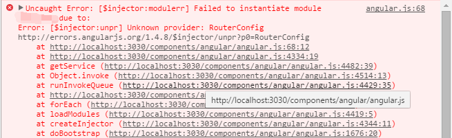

使用 `Angular` 开发项目已经有了不短的时间，在最近搭建一个项目的前端时遇到了**问题**。

随着项目的增大，通过 `angular-ui` 处理的路由配置的不断增加，使得 module.config 的内容不断膨胀，这时通常的做法是将所有的 router 配置抽出到一个文件中去统一配置，而 module.config 中只需做一个简单的路由 mapping，这样既方便代码的维护，又增加了代码的易读性。每当想建这样一个跨 `scope` 的单例数据源或者一个服务时同城就会很直接想到建一个 `factory` 或 `service` 去处理，于是我也建立了一个这样的 factory 来作为单例数据源通过 angular 注入的方式注入到 module.config 中，然而问题出现了，页面直接出现如下错误。

我再三仔细查看代码，发现语法上没有任何错误，最后从错误提示上的 Unknown provider 想起——**在 module.config 中只能注入 provider，而不能注入 service 或 factory**。

在重新查阅 API 文档和一些其他资料之后，我对 Angular $provide 有了全新的认识，纠正了我一些原有的错误想法。

首先，所有 Angular 的服务都是**单例**，这里的服务不单单指我前面提到的 `provider`, `service` 和 `factory`，还包括另外3个以前我并不知道的 `constant``, `value` 和 `decorator``。

然后再分别看看这6个方法的不同之处：

1. `provider`：`provider` 是一个构造器用来返回一个服务实例。需要注意的是，`provider` 的参数可以是一个构造函数也可以是对象，如果是一个对象，那这个对象必须提供 `$get` 属性，当 `provider` 被注入时调用 `$get` 属性返回所需要的实例；还有一点是，**在使用 `provider` 注入时，需在你定义的 `provider` 名后添加 Provider 后缀**，即 module.provider(**'listen'**, function(){})，在注入时就需要使用 xxService.$inject = [**'listenProvider'**];
2. `factory`: `factory` 就是通过 `provider` 第一个参数为对象的方法实现，`factory` 底层通过调用 $provide.provider(name, {$get: $getFn})，而 $getFn 就是自定义 `factory` 的参数，即 `factory` 所传的方法需返回一个对象，这个对象会绑定到 `provider` 的 `$get` 属性上。
3. `service`: `service` 也是对 `provider` 的一种封装，`service` 的第二个参数是一个构造函数，当service被注入时，会通过 `provider` 来返回一个服务实例。
4. `value` & `constant`：`value` 和 `constant` 两个方法的参数可以是任意的类型，当它被注入时返回一个包裹了这个值的服务。两者的不同之处在于，**`constant` 可以在 module.config 里被注入，而 `value` 不能，与此同时，`constant` 的值是常量不能修改也无法被 `decorator` 装饰**。
5. `decorator`：即装饰器，用于在 `service` 创建时对 `service` 进行重写或修改。

显然，使用 `constant` 服务来建立这个配置信息来解决之前提到的问题是最恰当的。