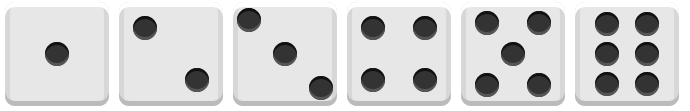

#### What is Flex?
Flex 是 Flexible Box 的缩写，意为"弹性布局"，用来为盒状模型提供最大的灵活性。

W3C 于 2009 年提出了这一方案，时至今日，常用的浏览器已经全部都提供了对它的支持（当然不包括 IE8）。

#### Why to use Flex?
简便的实现页面布局。

#### How to use Flex?
为一个元素简单地设置 display: flex; 就使得其成为 Flex 容器（flex container），其内部的所有子元素自动成为容器中的成员（flex item）。

容器默认存在两根轴：水平的主轴（`main axis`）和垂直的交叉轴（`cross axis`）。主轴的开始位置（与边框的交叉点）叫做（`main start`），结束位置叫做 `main end` ；交叉轴的开始位置叫做 `cross start`，结束位置叫做 `cross end`。

项目默认沿主轴水平排列。单个项目占据的主轴空间叫做 `main size`，占据的交叉轴空间叫做 `cross size`。

**注意：**当一个元素设置为 display: flex; 后，其子元素（即flex item）的 float，clear 和 vertical-align 属性将无效。

对于 Webkit 内核的浏览器需要加上 `-webkit` 前缀。

### Flex Container Attributes
----
1. `flex-direction`: row | row-reverse | column | column-reverse;
该属性决定 flex item 在容器中的排列方向，默认为 row，即水平从左 → 右排列；column为从 上 ↓ 下排列；加 -reverse 后缀，即和原先排列顺序相反。
2. `flex-wrap`: nowrap | wrap | wrap-reverse;
该属性决定 flex item 在容器中是否换行，换行的方式又是什么，默认为 nowrap，即不换行。wrap 为换行，当 `flex-direction` 为row时，内容从 上 ↓ 下按行排列；当 `flex-direction` 为 column 时，内容从 左 → 右按列排列；加 -reverse 后缀，即和原先排列顺序相反。
3. `flex-flow`: <flex-direction> || <flex-wrap>
该属性是 `flex-direction` 和 `flex-wrap` 的简写形式，默认值是原属性 `flex-direction` 和 `flex-wrap` 的默认值，即row nowrap。
4. `justify-content`: flex-start | flex-end | center | space-between | space-around;
该属性决定 flex item 在行内的水平对齐方式或列内的垂直对齐方式，默认值是 flex-start。
flex-start： 与轴的 start 对齐，即左对齐(flex-direction: row)，上对齐(flex-direction: column)
flex-end：与轴的 end 对齐，即右对齐(flex-direction:row)，下对齐(flex-direction:column)
center： 与轴的的中点对齐
space-between：与轴的两端对齐，flex-item 之间的间隔都相等，头尾的 flex item 紧贴轴的 start 位置
space-around：每个 flex item 两侧的间隔相等。所以，flex item 之间的间隔比 flex item 与轴的 start 之间的间隔大一倍
**注意：**
flex item 默认是没有间距的，间距是由 flex container 的宽度或高度与 flex item 的宽度或高度之间的差产生的，即如果 flex container 的宽度为1000px，flex item 的宽度为100px，container 下有 10 个 item，那无论 justify-content 设任何的值，展示都将是 10 个 item 紧贴地并列排列，item 与 item 之间没有任何间隙。
5. `align-items`: flex-start | flex-end | center | baseline | stretch;
该属性与 justify-content 相反，决定 flex item 在行内的垂直对齐方式或列内的水平对齐方式，默认值是 stretch。
flex-start：与轴的 start 对齐
flex-end：与轴的 end 对齐
center：与轴的的中点对齐
baseline： 与 flex item 的第一行文字的 baseline 对齐
stretch：如果 flex item 未设置宽度或高度或设为 auto，将占满这行的高度或这列的宽度
**注意：**
baseline 属性在 container 的 flex-direction 设置为 column 时无效。
当 align-items 属性值设置为 stretch 时，如一个 flex item 设置了宽度或高度，则这个 flex item 应用flex-start，且只对该 flex item 生效。
6. `align-content`: flex-start | flex-end | center | space-between | space-around | stretch;
该属性类似于 `justify-content` 属性，与之不同的是，该属性决定 flex item 每行或每列在 flex container 下的对齐方式，如果 flex item 只有一行或一列，则该属性无效，默认值为 stretch。
flex-start：与轴的 start 对齐
flex-end：与轴的 end 对齐
center：与轴的中点对齐
space-between：与轴的两端对齐，轴线之间的间隔都相等
space-around：每根轴线两侧的间隔都相等。所以，轴线之间的间隔比轴线与边框的间隔大一倍
stretch：轴线占满整个交叉轴
**注意：**
当 `align-content` 属性设定为 flex-start、flex-end 或 center时，轴与轴之间默认是没有间隔的。

### Flex Item Attributes
----
1. `order`: \<integer\>;
该属性定义 flex item 的排列顺序，数值越小，排列越靠前，默认值为0。
**注意：**数值可以为负数。
2. `flex-grow`: \<number\>;
该属性定义 flex item 的放大比例，默认值为 0，即使有空余空间也不放大该元素。
**注意：**数值可以为小数，但不能为负数。
3. `flex-shrink`: \<number\>;
该属性与 `flex-grow` 相反，定义 flex item 的缩小比例，默认值为1，即空间不足时，等比例缩小元素；flex-grow 为 0，则空间不足时也不缩小该元素。
**注意：**数值可以为小数，但不能为负数。
4. `flex-basis`: \<length\> | auto;
该属性定义在分配剩余空间之前，flex item 占所在轴的大小，默认值为 auto，即原有元素大小。
**注意：**该属性设定的大小为未分配剩余空间之前的大小，flex item 最终显示的大小会受 flex-grow 或 flex-shrink 的影响。
5. `flex`: auto | none | [ <`flex-grow`> <`flex-shrink`>? || <`flex-basis`> ];
该属性是 `flex-grow`、`flex-shrink` 和 `flex-basis` 的简写，默认值为各属性的默认值，0 1 auto。
该属性还有2个快捷值：auto(1 1 auto), 即 flex item 根据 container 的内容大小自动缩放；none(0 0 auto)，即 flex item 保持自身元素大小，不进行缩放。
6. `align-self`: auto | flex-start | flex-end | center | baseline | stretch;
该属性用来设置只用于自身的对齐方式，将覆盖 container 的 `align-items` 属性，默认值为 auto，即继承父属性的 `align-items` 属性。

### TRY
----
俗话说的好，光说不练假把式，既然已经清楚了概念，我就尝试使用这些特性，看到阮老师的另一篇文章后，自己也尝试做了一遍，通过 flex 完成了骰子的6个面。

[点击查看源码](http://plnkr.co/edit/BthfuHwFAlZiOUxrU99v?p=preview)

如果理解了 flex 容器的特性，那么上面的列子尝试起来并不难，只有在第 5 点的时候遇到一些小障碍，如何画中间那个点，最后是通过给第 3 个点增加两边的margin，使元素的宽度增加来处理。如果你也对这个有兴趣可以参考[这里](https://davidwalsh.name/flexbox-dice)，里面也有几种不同的实现，或许对你也有所启发，如果你有更好的想法，欢迎留言交流。

另外，在查资料时还发现 CSS3 box-flex，一看描述和内容，完全和 flex 是同一个东西啊。

* `display: box`：弹性模型第一版，不推荐使用（适用于老版本浏览器）。
* `display: flexbox`：box升级版，不推荐使用（适用于老版本浏览器）。
* `display: flex`：最新的弹性模型版本，推荐使用。

参考资料：
1. [阮一峰 Flex 布局教程：语法篇](http://www.ruanyifeng.com/blog/2015/07/flex-grammar.html?utm_source=tuicool)
2. [A Complete Guide to Flexbox](https://css-tricks.com/snippets/css/a-guide-to-flexbox/#flexbox-basics)
3. [阮一峰 Flex 布局教程：实例篇](http://www.ruanyifeng.com/blog/2015/07/flex-examples.html)
4. [Getting Dicey With Flexbox](https://davidwalsh.name/flexbox-dice)