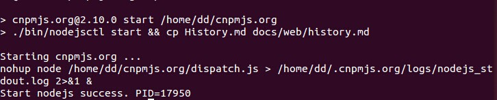
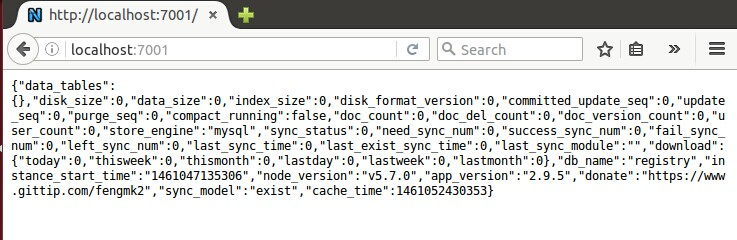
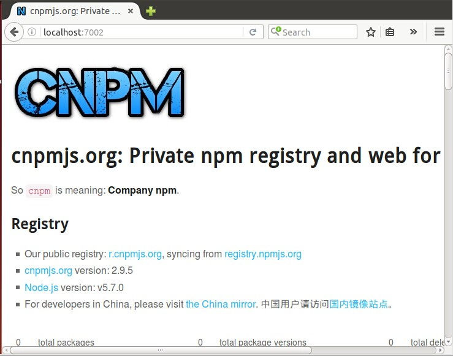
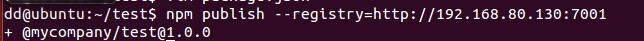
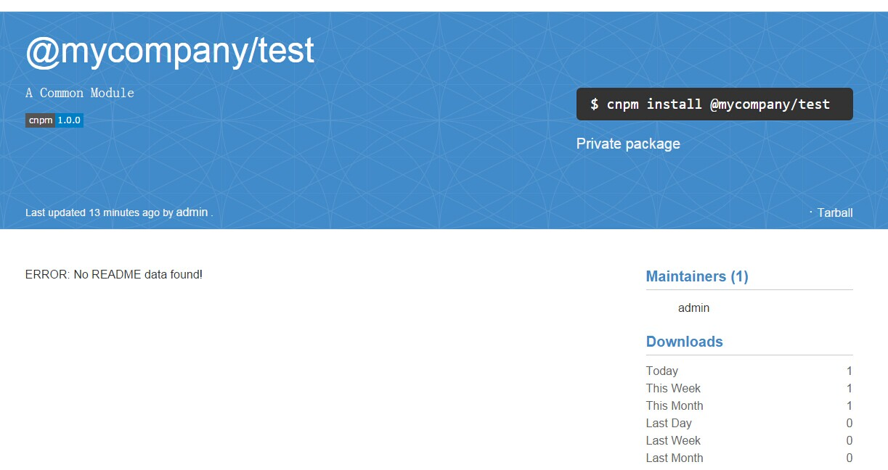
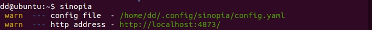
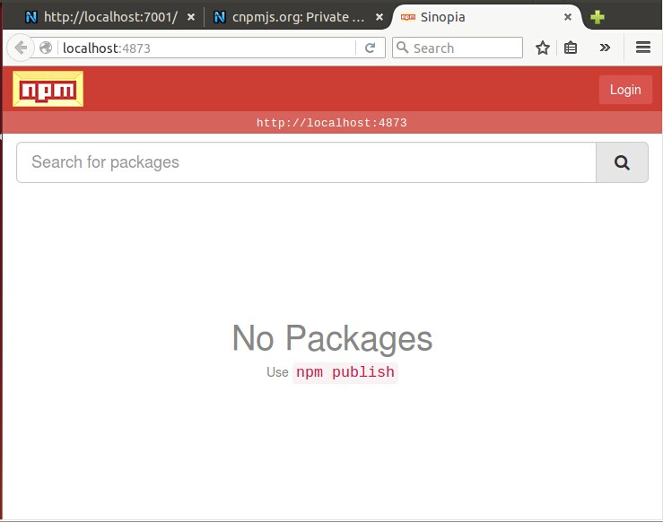

为何需要搭建企业私有 npm 服务器，主要有以下 2 点：

1. 网络因素（下载速度不佳，企业内网等）
2. 私有包的发布与管理

本文主要致力于如何搭建和运用企业私有 npm 服务器，以下所有案例都将私有 npm 服务器搭建在 VMware 虚拟机下的 linux 系统中，来模拟服务器环境。

## cnpm OR sinopia
### 1. cnpm

#### cnpm 的安装

1. 下载 cnpm: git clone git://github.com/fengmk2/cnpmjs.org.git $HOME/cnpmjs.org
2. cd $HOME/cnpmjs.org
3. 进入 mysql
    1. CREATE DATABASE privateNPM;
    2. use privateNPM; 
    3. source docs/db.sql
4. 添加配置信息  
    建议在 config 目录下新建 `config.js` 文件来配置 cnpm，而不是直接修改 config 目录下的 `index.js`，因为 `index.js 会读取 config 目录下的 `config.js`，如果存在就会覆盖默认配置。

```JavaScript

    // index.js
    if (process.env.NODE_ENV !== 'test') {
      var customConfig;
      if (process.env.NODE_ENV === 'development') {
        customConfig = path.join(root, 'config', 'config.js');
      } else {
        // 1. try to load `$dataDir/config.json` first, not exists then goto 2.
        // 2. load config/config.js, everything in config.js will cover the same key in index.js
        customConfig = path.join(dataDir, 'config.json');
        if (!fs.existsSync(customConfig)) {
          customConfig = path.join(root, 'config', 'config.js');
        }
      }
      if (fs.existsSync(customConfig)) {
        copy(require(customConfig)).override(config);
      }
    }
    module.exports = config;

    // config.js
    module.exports = {
      debug: false,
      database: {
        db: 'privateNPM',     // 数据库名，默认为cnpmjs_test
        host: '127.0.0.1',    // 服务器地址
        port: 3306,           // 端口
        username: 'root',     // 用户名
        password: '      ',   // 密码
        dialect: 'mysql'      // 使用mysql，默认为sqlite, 还支持postgres,mariadb,暂时不支持oracle
      },
      syncModel: 'exist'         // 同步已存在的模块, 默认为none，即不同步, 还有个选项为all，同步所有模块
    }; 
```

配置字段含义在 `index.js` 内都有详细注释。 

注意：**重要提示**如果搭建的 cnpm 希望被其他电脑访问，一定要将 `index.js` 中的

```JavaScript
    bindingHost: '127.0.0.1', // only binding on 127.0.0.1 for local access
```

这行注释。

cnpm 默认的两个访问端口是：

　　1) 7001是 registry 端口，对应 registryPort 配置项

　　2) 7002是 web 端口，对应 webPort 配置项

这两项都可以通过修改 `config.js` 文件来配置。
 
5. npm install
6. npm start // 启动cnpm服务
    1. 启动成功  
    
    1. 验证：访问 http://localhost:7001/
    

    2. 验证：访问 http://localhost:7002/
    

至此，cnpm 的安装已经完成了。

#### cnpm 的使用

服务器搭建完成之后就可以使用了，该如何使用哪？

最简单的方式就是下载 npm 包时修改下载依赖的目标地址。

```bash
    npm install webpack -g --registry=http://192.168.80.130:7001 // IP为你搭建服务器的地址，注意不要忘了端口号
```

第一次下载会同步许多包，比较慢，喝杯咖啡吧。（安装过程中可能会发生找不到对应版本的安装错误 **No compatible version found:** ，那是因为安装顺序的问题，多装几次，或者手动先安装指定版本就能修复这个问题）

安装完成后可以访问 cnpm 的 web 端口可以看到 downloads 已发生了变化，然后在其他机器上尝试下载 webpack，那你就能感觉那飞一般的感觉。

如果，觉得每次在 npm 后面加 --registry=http://192.168.80.130:7001 很麻烦，也可以通过

```Bash
    npm config set registry http://192.168.80.130:7001
```

设置默认的资源地址。

#### 发布私有 npm 包

在发布 npm 包之前，需要先将原先的 `config/config.js` 中添加一些配置属性：

```JavaScript
    enablePrivate: true, // 只有管理员可以发布 npm 包，默认为 false，即任何人都可以发布包
    admins: {
      admin: 'test@mycompany.com' // 管理员权限
    },
    scopes: ['@mycompany'], // 私有包必须依附于 scope 下
```

重新启动 cnpm 来应用这些配置。

然后，新建一个简单的项目来测试发布，在 package.json 文件中加入代码：

```JavaScript
     "name": "@mycompany/testjs", // 包名，之前必须加入 scope 名
     "version": "1.0.2"           // 版本信息
```

一切准备就绪就可以发布了。

```Bash
    npm login --registry=http://192.168.80.130:7001 // publish 之前需要登录用户
    Username: admin // 管理员名
    Password: whateveryoulike
    Email: test@mycompany.com // 一定要填管理员账户邮箱地址，不然无法发布，因为设置了 enablePrivate: true

    npm publish --registry=http://192.168.80.130:7001
```

看到以下信息就发布成功了。



当然，其他机器也已经能通过

```Bash
   npm install @mycompany/test -registry=http://192.168.80.130:7001
```

来安装私有包了。

与此同时，还可以访问 http://192.168.80.130:7002/package/@mycompany/test 来查看发布包的详细信息。



至此，cnpm 的搭建和使用已经全部完成，接下来我们看看 sinopia。

### 2. sinopia

#### sinopia 的安装

sinopia 的安装极其简单，只需一行代码：

```Bash
    npm install -g sinopia
```

Ok. 这就安装好啦，就这么简单。启动服务：

```Bash
    sinopia
```

看到以下图就启动成功：



**注意：**上面输出的两条信息相当重要

1. 服务器中 sinopia 的配置文件存放的位置，后期的配置都需要修改这个文件
2. sinopia 提供服务的地址，默认4873



sinopia 就搭建完成了，还能更简单么？No。

#### 配置 sinopia

sinopia 搭建完成后就可以发布 npm 包了，上文已经叙述过如何发布，这里就不再重复了，主要还是说说如何个性化配置 sinopia。

编辑刚刚 log 中输出的配置文件，可以配置 sinopia。

生成的默认配置文件中的配置都是些常用配置：

```
    // config.yaml
    storage: ./storage // npm 包存放的仓库位置
    auth:   
        htpasswd:  
            file: ./htpasswd  
            max_users: -1 // 允许注册用户的最大数，-1则不允许添加用户
    uplinks:
        npmjs:
            url: https://registry.npmjs.org/ // 当资源本地不存在时，下载资源的地址，此处可以改为淘宝的镜像https://registry.npm.taobao.org
    packages:
      '@*/*':                           // 包通配符，这里匹配私有包
        # scoped packages
        access: $all                    // 下载权限，权限分为3种，分别是 $all 任何人，$anonymous 未登陆，$authenticated 登陆用户
        publish: $authenticated         // 发布权限，登陆用户
    
      '*':
        access: $all
        publish: $authenticated
        proxy: npmjs                    // 当资源本地不存在时，下载资源的地址，对应 uplinks 的配置

```

如果想要查看详细的可配置项，可以到 sinopia 的存储位置中查看，也可以上 [github](https://github.com/rlidwka/sinopia/blob/master/conf/full.yaml) 查看，每个配置项都有详细的注释。

### 3. cnpm VS sinopia

|   -   | cnpm | sinopia |
| :---: | :---: | :---: |
| 系统支持 | 非windows | 全系统 |
| 安装 | 复杂 | 简单 |
| 配置 | 较多，适合个性化需求较多的 | 较少 |
| 配置——修改默认镜像 | 不支持 | 支持 |
| 存储 | mysql | 文件格式，直观 |
| 服务托管 | 默认后台运行 | pm2, doker, forever |

#### 到底谁比较好？

有言道：脱离业务场景谈解决方案，都是耍流氓。

在此，我就不耍流氓了。

#### 参考资料：

1. [github cnpm](https://github.com/cnpm/cnpmjs.org)
2. [Deploy a private npm registry in 5 minutes](https://github.com/cnpm/cnpmjs.org/wiki/Deploy-a-private-npm-registry-in-5-minutes)
3. [MacPro 使用cnpmjs搭建私有npm服务](http://www.cnblogs.com/wyzfzu/p/4149310.html)
4. [CNPM搭建私有的NPM服务](http://blog.fens.me/nodejs-cnpm-npm/)
5. [github sinopia](https://github.com/rlidwka/sinopia)
6. [Sinopia | 从零开始搭建npm仓库](http://mp.weixin.qq.com/s?__biz=MzA5Nzk5MzE3Ng==&mid=401510950&idx=1&sn=f775d53fa36e2a7284eb6399e0a0f6c1&scene=4#wechat_redirect)